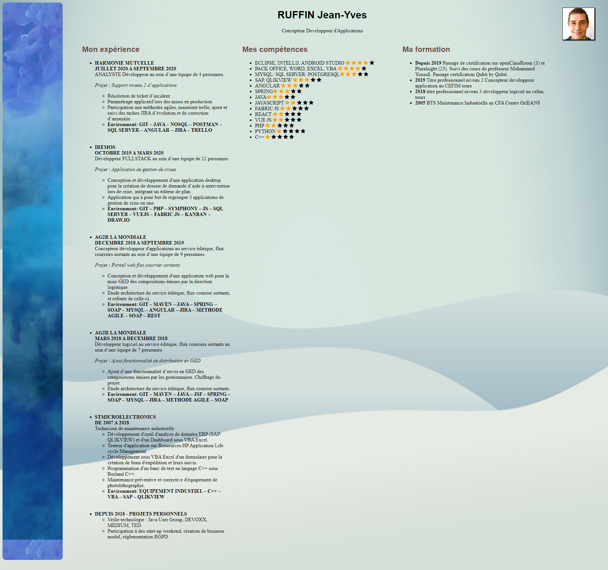
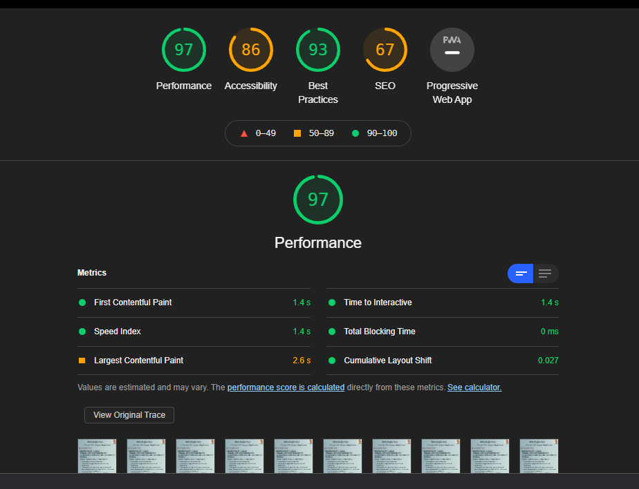

# HTML CSS
<!-- TOC -->

- [HTML CSS](#html-css)
- [HTML](#html)
    - [Decouvrez le fonctionnement des sites web](#decouvrez-le-fonctionnement-des-sites-web)
    - [Creez votre premiere page web en HTML](#creez-votre-premiere-page-web-en-html)
    - [Organisez votre texte](#organisez-votre-texte)
    - [Exemple HTML](#exemple-html)
    - [Creez des liens (hyperlink)](#creez-des-liens-hyperlink)
    - [Inserez des images](#inserez-des-images)
    - [Entrainez-vous en structurant votre CV](#entrainez-vous-en-structurant-votre-cv)
- [CSS](#css)
    - [Mettez en place le CSS](#mettez-en-place-le-css)
    - [Formatez du texte](#formatez-du-texte)
    - [Ajoutez de la couleur et un fond](#ajoutez-de-la-couleur-et-un-fond)
    - [Creez des bordures et des ombres](#creez-des-bordures-et-des-ombres)
    - [Creez des apparences dynamiques](#creez-des-apparences-dynamiques)
    - [Exemple CSS](#exemple-css)
- [Structurez votre page](#structurez-votre-page)
    - [Decouvrez le modele des boites](#decouvrez-le-modele-des-boites)
    - [Faites votre mise en page avec Flexbox](#faites-votre-mise-en-page-avec-flexbox)
    - [Exemple FLEX et autre](#exemple-flex-et-autre)
    - [Autres techniques de mise en page](#autres-techniques-de-mise-en-page)
- [Fonctionnalites evoluees](#fonctionnalites-evoluees)
    - [Ajouter des tableaux](#ajouter-des-tableaux)
    - [Creez des formulaires](#creez-des-formulaires)
    - [Enrichissez votre site avec de la video et de l'audio](#enrichissez-votre-site-avec-de-la-video-et-de-laudio)
    - [Utilisez le responsive design avec les Media Queries](#utilisez-le-responsive-design-avec-les-media-queries)
- [LightHouse](#lighthouse)

<!-- /TOC -->


# HTML
## Decouvrez le fonctionnement des sites web

* Le Web a ete invente par Tim Berners-Lee au debut des annees 1990.
* Pour creer des sites web, on utilise deux langages informatiques :
	* HTML : permet d'ecrire et organiser le contenu de la page (paragraphes, titres)
	* CSS : permet de mettre en forme la page (couleur, taille).

* Il y a eu plusieurs versions des langages HTML et CSS. Les dernieres versions sont HTML5 et CSS3.
* Le navigateur web est un programme qui permet d'afficher des sites web. Il lit les langages HTML et CSS pour savoir ce qu'il doit afficher.
* Il existe de nombreux navigateurs web differents : Google Chrome, Mozilla Firefox, Internet Explorer, Safari, Opera. Chacun affiche un site web de maniere legerement differente des autres navigateurs.
* Nous allons apprendre a utiliser les langages HTML et CSS. Nous travaillerons dans un programme appele editeur de texte (Sublime Text, Notepad++, jEdit, vim)

## Creez votre premiere page web en HTML

* On utilise l'editeur de texte (Sublime Text, Notepad++, jEdit, vim) pour creer un fichier ayant l'extension .html  (par exemple : test.html  ). Ce sera notre page web.
* Ce fichier peut etre ouvert dans le navigateur web simplement en faisant un double-clic dessus.
* A l'interieur du fichier, nous ecrirons le contenu de notre page, accompagne de balises HTML.
* Les balises peuvent avoir plusieurs formes :
	* `<balise> </balise>`  : elles s'ouvrent et se ferment pour delimiter le contenu (debut et fin d'un titre, par exemple) ;
	* `<balise />`  : balises orphelines (on ne les insere qu'en un seul exemplaire), elles permettent d'inserer un element a un endroit precis (par exemple une image).
* Les balises sont parfois accompagnees d'attributs pour donner des indications supplementaires (exemple : `<image nom="photo.jpg" />`).
* Une page web est constituee de deux sections principales : un en-tete ( `<head>`  ) et un corps ( `<body>`  ).
* On peut afficher le code source de n'importe quelle page web en faisant un clic droit puis en selectionnant *Afficher le code source de la page*.

## Organisez votre texte

* Le HTML comporte de nombreuses balises qui nous permettent d'organiser le texte de notre page. Ces balises donnent des indications comme "Ceci est un paragraphe", "Ceci est un titre", etc.
* Les paragraphes sont definis par la balise `<p></p>`, et les sauts de ligne par la balise `<br/>`.
* Il existe six niveaux de titre, de `<h1></h1>`  a `<h6></h6>`  , a utiliser selon l'importance du titre.
* On peut mettre en valeur certains mots avec les balises `<strong>`  , `<em>`  et `<mark>`  .
* Pour creer des listes, on doit utiliser la balise `<ul>`  (liste a puces, non ordonnee) ou `<ol>`  (liste ordonnee). a l'interieur, on insere les elements avec une balise `<li>`  pour chaque item.

## Exemple HTML

```htm
<!DOCTYPE html>
<html>
  <head>
    <meta charset="utf-8" />
    <title>Ma passion pour les animaux</title>
  </head>

  <body>
    <h1>Les animaux merveilleux</h1>
    <p>Voici mes animaux preferes :
    <ol>
      <li><strong>La giraffe</strong></li>
      <li>La galinette cendree</li>
      <li>La rainette</li>
    </ol>
    </p>
  </body>
</html>
```

[Cheat sheet HTML](WebContent/Resources/HTML-CHEAT-SHEET.png)

## Creez des liens (hyperlink)

* Les liens permettent de changer de page et sont, par defaut, ecrits en bleu et soulignes.
* Pour inserer un lien, on utilise la balise `<a>`  avec l'attribut href  pour indiquer l'adresse de la page cible. Exemple : `<a href="https://openclassrooms.com">`.
* On peut faire un lien vers une autre page de son site, simplement en ecrivant le nom du fichier : `<a href="page2.html">`.
* Les liens permettent aussi d'amener vers d'autres endroits sur la meme page. Il faut creer une ancre avec l'attribut id  pour marquer un endroit dans la page, puis faire un lien vers l'ancre comme ceci : `<a href="#ancre">`.

## Inserez des images

* Il existe plusieurs formats d'images adaptees au Web :
	* JPEG : pour les photos
	* PNG : pour toutes les autres illustrations
	* GIF : similaire au PNG, plus limite en nombre de couleurs mais qui peut etre anime

* On insere une image avec la balise  ``. Elle doit obligatoirement comporter au moins ces deux attributs :  src  (nom de l'image) et  alt  (courte description de l'image).
* Si une image illustre le texte (et n'est pas seulement decorative), il est conseille de la placer au sein d'une balise  `<figure>`  . La balise  `<figcaption>`  permet d'ecrire la legende de l'image.

## Entrainez-vous en structurant votre CV

* etape 1 : Creez une page HTML.
* etape 2 : Ajoutez votre nom et votre prenom en titre principal.
* etape 3 : Ajoutez une photo miniature, sur laquelle on pourra cliquer pour avoir une version agrandie.
* etape 4 : Ajoutez 3 sections avec un titre secondaire (mon experience, mes competences, ma formation). Chaque section contient un paragraphe ou une liste a puce.

# CSS
## Mettez en place le CSS


[S'ENTRAINER AVEC LES SELECTEUR SUR FLUKEOUT](https://flukeout.github.io/)


* CSS est un autre langage qui vient completer le HTML. Son role est de mettre en forme votre page web.
* Il faut etre vigilant sur la compatibilite des navigateurs avec certaines fonctionnalites recentes de CSS3. Quand un navigateur ne connait pas une instruction de mise en forme, il l'ignore simplement.
* On peut ecrire le code CSS a plusieurs endroits differents, le plus conseille etant de creer un fichier separe portant l'extension .css  (exemple : `style.css`  ).
* En CSS, on selectionne quelles portions de la page HTML on veut modifier, et on change leur presentation avec des proprietes CSS :

```css
balise1
{
    propriete1: valeur1;
    propriete2: valeur2;
}
```
* Il existe de nombreuses facons de selectionner la portion de la page que l'on veut mettre en forme. Par exemple, on peut viser :
	* toutes les balises d'un meme type, en ecrivant simplement leur nom ( h1  , par exemple) ;
	* certaines balises specifiques, auxquelles on a donne des noms a l'aide des attributs class  ou id  ( `.nomclasse`  ou `#nomid`  ) ;
	* uniquement les balises qui se trouvent a l'interieur d'autres balises (h3 em  ).

## Formatez du texte

* On modifie la taille du texte avec la propriete CSS `font-size`  . On peut indiquer la taille en pixels (16px), en em (1.3em), en pourcentage (110 %), etc.
* On change la police du texte avec `font-family`  . Attention, seules quelques polices sont connues par tous les ordinateurs. Vous pouvez cependant utiliser une police personnalisee avec la directive `@font-face`  : cela forcera les navigateurs a telecharger la police de votre choix.
* De nombreuses proprietes de mise en forme du texte existent : `font-style`  pour l'italique, `font-weight` pour la mise en gras, `text-decoration` pour le soulignement, etc.
* Le texte peut ere aligne avec `text-align`.
* On peut faire en sorte qu'une image soit habillee (entouree) de texte avec `float`

## Ajoutez de la couleur et un fond

* On change la couleur du texte avec la propriete `color`  , la couleur de fond avec `background-color`.
* On peut indiquer une couleur en ecrivant son nom en anglais ( `black`  , par exemple), sous forme hexadecimale ( `#FFC8D3`  ) ou en notation RGB ( `rgb(250,25,118)`  ).
* On peut ajouter une image de fond avec `background-image`. On peut choisir de fixer l'image de fond, de l'afficher en mosaique ou non, et meme de la positionner ou on veut sur la page.
* On peut rendre une portion de la page transparente avec la propriete `opacity`  ou avec la notation RGBa (identique a la notation RGB, avec une quatrieme valeur indiquant le niveau de transparence).

## Creez des bordures et des ombres

* On peut appliquer une bordure a un element avec la propriete `border`. Il faut indiquer la largeur de la bordure, sa couleur et son type (trait continu, pointilles).
* On peut arrondir les bordures avec `border-radius`.
* On peut ajouter une ombre aux blocs de texte avec `box-shadow`. On doit indiquer le decalage vertical et horizontal de l'ombre, son niveau d'adoucissement et sa couleur.
* Le texte peut lui aussi avoir une ombre avec `text-shadow`.

## Creez des apparences dynamiques

* En CSS, on peut modifier l'apparence de certaines sections dynamiquement, apres le chargement de la page, lorsque certains evenements se produisent. On utilise pour cela les pseudo-formats.
* Le pseudo-format `:hover`  permet de changer l'apparence au survol (par exemple : `a:hover`  pour modifier l'apparence des liens lorsque la souris pointe dessus).
* Le pseudo-format `:active`  modifie l'apparence des liens au moment du clic, `:visited`  lorsqu'un lien a deja ete visite.
* Le pseudo-format `:focus`  permet de modifier l'apparence d'un element selectionne.

## Exemple CSS

```css

// Affiche le titre h1 en rouge et agrandi le titre h1 pour lui donner une taille de 3em.
h1{
  color:red;
  font-size: 3em;
}
// Centre la figure (figure) et sa description.
figure{
  text-align:center;
}
// Ajoute une bordure continue de 2px en rouge autour de la liste a puces et ajoute une ombre au cadre autour de la liste a puces.
ul{
  border: solid 2px red;
  box-shadow: 2px 2px blue;
}
// Affiche les liens en gras lorsqu'on les survole.

a:hover {
  color: yellow;
}
```

# Structurez votre page

* Plusieurs balises ont ete introduites avec HTML5 pour delimiter les differentes zones qui constituent la page web :
	* `<header>`  : en-tete
	* `<footer>`  : pied de page
	* `<nav>`  : liens principaux de navigation
	* `<section>`  : section de page
	* `<aside>`  : informations complementaires
	* `<article>`  : article independant

* Ces balises peuvent etre imbriquees les unes dans les autres. Ainsi, une section peut avoir son propre en-tete.
* Ces balises ne s'occupent pas de la mise en page. Elles servent seulement a indiquer a l'ordinateur le sens du texte qu'elles contiennent. On pourrait tres bien placer l'en-tete en bas de la page, si on le souhaitait.

## Decouvrez le modele des boites

* On distingue deux principaux types de balises en HTML :
	* le type block ( `<p>`  , `<h1>`) : ces balises creent un retour a la ligne et occupent par defaut toute la largeur disponible. Elles se suivent de haut en bas ;
	* le type inline ( `<a>`  , `<strong>`) : ces balises delimitent du texte au milieu d'une ligne. Elles se suivent de gauche a droite.
* On peut modifier la taille d'une balise de type block avec les proprietes CSS `width`  (largeur) et `height`  (hauteur).
* On peut definir des minima et maxima autorises pour la largeur et la hauteur: `min-width`,`max-width`, `min-height`, `max-height`.
* Les elements de la page disposent chacun de marges interieures (`padding`) et exterieures (`margin`).
* S'il y a trop de texte a l'interieur d'un bloc de dimensions fixes, il y a un risque de debordement. Dans ce cas, il peut etre judicieux de rajouter des barres de defilement avec la propriete `overflow`, ou de forcer la cesure avec `word-wrap`.

## Faites votre mise en page avec Flexbox

[S'ENTRAINER AVEC FLEXBOX SUR FLEXBOXFROGGY](https://flexboxfroggy.com/)

[S'ENTRAINER AVEC FLEXBOX SUR FLEXBOXDEFENSE](http://www.flexboxdefense.com/)

* Il existe plusieurs techniques pour positionner les blocs sur la page. Flexbox est la technique la plus recente et de loin la plus puissante.
* Le principe de Flexbox est d'avoir un conteneur, avec plusieurs elements a l'interieur. Avec `display: flex`; sur le conteneur, les elements a l'interieur sont agences en mode Flexbox (horizontalement, par defaut).
* Flexbox peut gerer toutes les directions. Avec `flex-direction`, on peut indiquer si les elements sont agences horizontalement (par defaut) ou verticalement. Cela definit ce qu'on appelle l'axe principal.
* L'alignement des elements se fait sur l'axe principal avec `justify-content` , et sur l'axe secondaire avec `align-items`.
* Avec `flex-wrap`, on peut autoriser les elements a revenir a la ligne s'ils n'ont plus d'espace.
* S'il y a plusieurs lignes, on peut indiquer comment les lignes doivent se repartir entre elles avec `align-content`.
* Chaque element peut etre reagence en CSS avec `order`.
* Avec la super-propriete `flex`, on peut autoriser nos elements a occuper plus ou moins d'espace restant.


## Exemple FLEX et autre

```css
// Permet de retirer la puce de la liste
ul {
  list-style-type: none;
}
// Activation de flex
#topsection {
  display:flex;
}
// Format du paragraphe
p {
  width: 80%;
  text-align: justify;
  margin-left:auto;
  margin-right:auto;
}
```

## Autres techniques de mise en page

* La technique de mise en page la plus recente et la plus puissante est Flexbox. C'est celle que vous devriez utiliser si vous en avez la possibilite.
* D'autres techniques de mise en page restent utilisees, notamment sur des sites plus anciens : le positionnement flottant et le positionnement `inline-block` . Il est conseille de les connaitre.
* Le positionnement flottant (avec la propriete `float`) est l'un des plus utilises a l'heure actuelle. Il permet par exemple de placer un menu a gauche ou a droite de la page. Neanmoins, cette propriete n'a pas ete initialement concue pour cela et il est preferable, si possible, d'eviter cette technique.
* Le positionnement `inline-block` consiste a affecter un type `inline-block`  a nos elements grace a la propriete `display`. Ils se comporteront comme des inlines (placement de gauche a droite) mais pourront etre redimensionnes comme des blocs (avec `width`  et `height`). Cette technique est a preferer au positionnement flottant.
* Le positionnement absolu permet de placer un element ou l'on souhaite sur la page, au pixel pres.
* Le positionnement fixe est identique au positionnement absolu, mais l'element restera toujours visible meme si on descend plus bas dans la page.
* Le positionnement relatif permet de decaler un bloc par rapport a sa position normale.
* Un element A positionne en absolu a l'interieur d'un autre element B (lui-meme positionne en absolu, fixe ou relatif) se positionnera par rapport a l'element B, et non par rapport au coin en haut a gauche de la page.

# Fonctionnalites evoluees
## Ajouter des tableaux

* Un tableau s'insere avec la balise `<table>`  et se definit ligne par ligne avec `<tr>`.
* Chaque ligne comporte des cellules `<td>`  (cellules normales) ou `<th>`  (cellules d'en-tete).
* Le titre du tableau se definit avec `<caption>`.
* On peut ajouter une bordure aux cellules du tableau avec `border`. Pour fusionner les bordures, on utilise la propriete CSS `border-collapse`.
* Un tableau peut etre divise en trois sections : `<thead>`  (en-tete), `<tbody>`  (corps) et `<tfoot>`  (bas du tableau). L'utilisation de ces balises n'est pas obligatoire.
* On peut fusionner des cellules horizontalement avec l'attribut `colspan`  ou verticalement avec `rowspan`. Il faut indiquer combien de cellules doivent etre fusionnees.

## Creez des formulaires

* Un formulaire est une zone interactive de la page, dans laquelle vos visiteurs peuvent saisir des informations.
* On delimite un formulaire avec la balise `<form>`, a laquelle il faut ajouter deux attributs : `method`(mode d'envoi des donnees) et `action` (page vers laquelle le visiteur sera redirige apres envoi du formulaire, et qui traitera les informations).
* Une grande partie des elements du formulaire peut s'inserer avec la balise `<input />`. La valeur de son attribut type  permet d'indiquer quel type de champ doit etre insere :
	* `text` : zone de texte
	* `password`: zone de texte pour mot de passe
	* `tel`: numero de telephone
	* `checkbox`: case a cocher

* La balise `<label>` permet d'ecrire un libelle. On l'associe a un champ de formulaire avec l'attribut `for`, qui doit avoir la meme valeur que l' `id` du champ de formulaire.
* On peut rendre un champ obligatoire avec l'attribut `required`, faire en sorte qu'il soit selectionne par defaut avec `autofocus`, donner une indication dans le champ avec `placeholder`.
* Pour recuperer ce que les visiteurs ont saisi, le langage HTML ne suffit pas. Il faut utiliser un langage serveur comme PHP.

## Enrichissez votre site avec de la video et de l'audio

* Inserer de la musique ou de la video n'etait pas possible autrefois en HTML. Il fallait recourir a un plugin comme Flash.
* Depuis HTML5, les balises `<audio>`  et `<video>`  ont ete introduites et permettent de jouer de la musique et des videos sans plugin..
* Il existe plusieurs formats audio et video. Il faut notamment connaitre :
	* pour l'audio : MP3 et Ogg Vorbis ;
	* pour la video : H.264, Ogg Theora et WebM.

* Aucun format n'est reconnu par l'ensemble des navigateurs : il faut proposer differentes versions de sa musique ou de sa video pour satisfaire tous les navigateurs.
* Il faut ajouter l'attribut controls  aux balises `<audio>`  et `<video>`  pour permettre au visiteur de lancer ou d'arreter le media.
* Ces balises ne sont pas concues pour empecher le telechargement de la musique et de la video. Vous ne pouvez pas proteger votre media contre la copie.

## Utilisez le responsive design avec les Media Queries

* Les media queries permettent de charger des styles CSS differents en fonction de certains parametres.
* Les parametres autorises par les media queries sont nombreux : nombre de couleurs, resolution de l'ecran, orientation. En pratique, on s'en sert surtout pour modifier l'apparence du site en fonction des differentes resolutions d'ecran.
* On cree une media query avec la directive `@media`  suivie du type d'ecran et d'une ou plusieurs conditions (comme la largeur maximale d'ecran). Le style CSS qui suit sera active uniquement si les conditions sont remplies.
* Les navigateurs mobiles simulent une largeur d'ecran : on appelle cela le `viewport`.
* On peut cibler les smartphones grace a une regle basee sur le nombre reel de pixels affiches a l'ecran : `max-device-width`.



# LightHouse

Dans la console d'inspection cliquer sur LightHouse pour inspecter vvotre page html et controler la performance du site.


